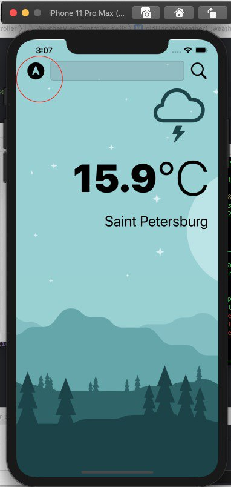
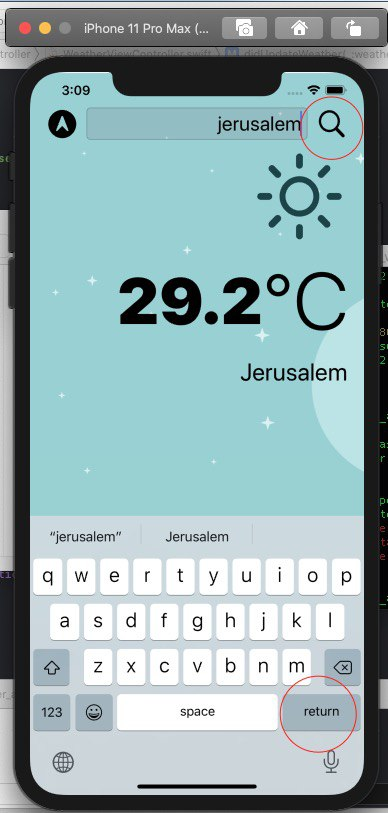

# clima_weather_app

App includes:

 - Dark mode and vector assets 
 - UITextField 
 - Implement Delegate Design Pattern 
 - Work with openweather's API, making HTTP request with URLSession 
 - Parse JSON with JSONDecoder 
 - CoreLocationApp
 
## How it works: ##

You can get your weather in 2 different ways:

1) By using your current location (my location is St.Petersburg):

Rainy as always

2) Text name of the city in searchTextField and press returnButton on keyboard or searchButton on appScreen:

